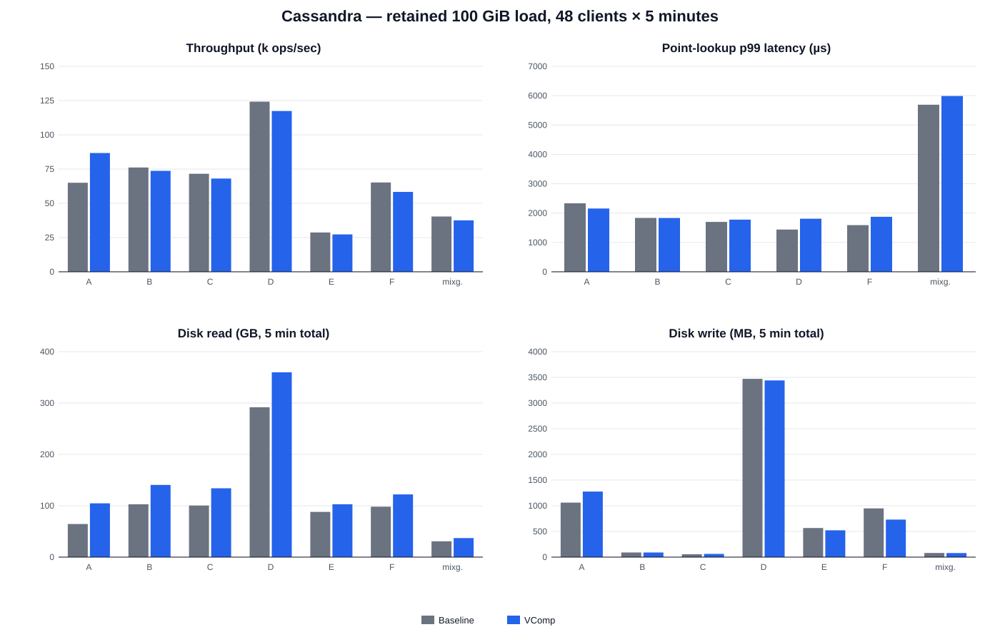

# Cassandra 100 GiB YCSB / MixGraph comparison

- Inputs: preserved baseline and VComp DBs; one isolated hard-linked checkpoint per workload
- Workload: 48 client threads, 300 seconds each; same seed for both systems
- Cache start: scoped `POSIX_FADV_DONTNEED` on each checkpoint before Cassandra startup
- Disk I/O: `/proc/diskstats` delta for `md0` over the exact client interval
- Cassandra memory: 4 GiB JVM heap plus the host OS page cache; Cassandra has no
  Pebble-equivalent 32 GiB block-cache setting

Raw checkpoints and logs:
`/work/vcomp-pebble-1tb/cassandra-paper-workloads-100g-20260912-160700`

## Main comparison

| Workload | Throughput delta (VComp vs baseline) | Relevant p99 delta | Disk-read delta |
|---|---:|---:|---:|
| A | +33.43% | -7.55% point | +62.75% |
| B | -3.20% | -0.17% point | +36.57% |
| C | -4.83% | +4.70% point | +33.43% |
| D | -5.49% | +25.53% point | +23.33% |
| E | -4.89% | +6.39% scan | +16.86% |
| F | -10.58% | +17.91% point | +24.31% |
| MixGraph | -6.99% | +5.18% point | +20.61% |

The databases are not logically equivalent inputs. The audited load already
showed 66,278,498 baseline rows versus 67,768,639 VComp rows, and different
full-table fingerprints. This workload run makes the consequence visible: for
example, YCSB C misses were 42.57% for baseline and 34.46% for VComp. The
current materializer reconstructs keys from the learned model when the KMV is
incomplete (`VCompMaterializedKeyIterator`); it does not reproduce the exact
surviving baseline key set. Therefore these numbers accurately characterize
the two retained DBs, but cannot yet be treated as a pure compaction-performance
comparison over identical logical contents.

All 14 workload runs produced valid JSON and a `SUCCESS` marker, reported zero
pending compactions at the end of the client interval, and logged no workload
exception, timeout, OOM, or Cassandra `ERROR` entry. The Cassandra daemon was
stopped after the campaign.

| Workload | System | Throughput (ops/s) | Point p50 (µs) | Point p95 (µs) | Point p99 (µs) | Scan p99 (µs) | Read misses | Disk read (GB) | Disk write (MB) |
|---|---|---:|---:|---:|---:|---:|---:|---:|---:|
| A | Baseline | 64982 | 505 | 1234 | 2333 | 0 | 2162356 | 64.387 | 1061.601 |
| A | VComp | 86706 | 576 | 1489 | 2157 | 0 | 2716643 | 104.790 | 1275.822 |
| B | Baseline | 76159 | 590 | 1184 | 1835 | 0 | 5521814 | 102.905 | 90.087 |
| B | VComp | 73720 | 596 | 1330 | 1832 | 0 | 5161346 | 140.534 | 90.763 |
| C | Baseline | 71548 | 624 | 1150 | 1698 | 0 | 9138143 | 100.404 | 55.161 |
| C | VComp | 68095 | 632 | 1303 | 1778 | 0 | 7039518 | 133.966 | 62.398 |
| D | Baseline | 124196 | 292 | 821 | 1440 | 0 | 4273826 | 291.827 | 3471.491 |
| D | VComp | 117378 | 298 | 1008 | 1807 | 0 | 3901864 | 359.913 | 3440.017 |
| E | Baseline | 28677 | 0 | 0 | 0 | 4231 | 0 | 88.017 | 567.190 |
| E | VComp | 27276 | 0 | 0 | 0 | 4502 | 0 | 102.857 | 521.585 |
| F | Baseline | 65226 | 469 | 1137 | 1589 | 0 | 3702812 | 98.251 | 948.982 |
| F | VComp | 58325 | 534 | 1391 | 1874 | 0 | 3315854 | 122.134 | 731.165 |
| MixGraph | Baseline | 40354 | 840 | 2990 | 5693 | 33980 | 3595547 | 30.776 | 80.515 |
| MixGraph | VComp | 37533 | 904 | 3160 | 5988 | 39715 | 3215962 | 37.118 | 79.716 |
