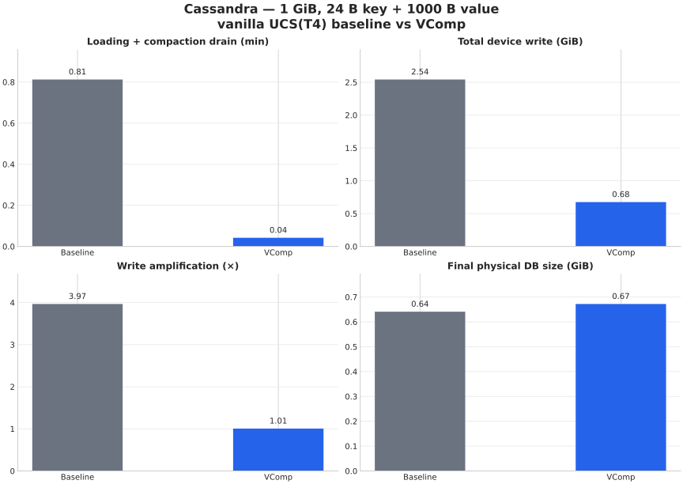
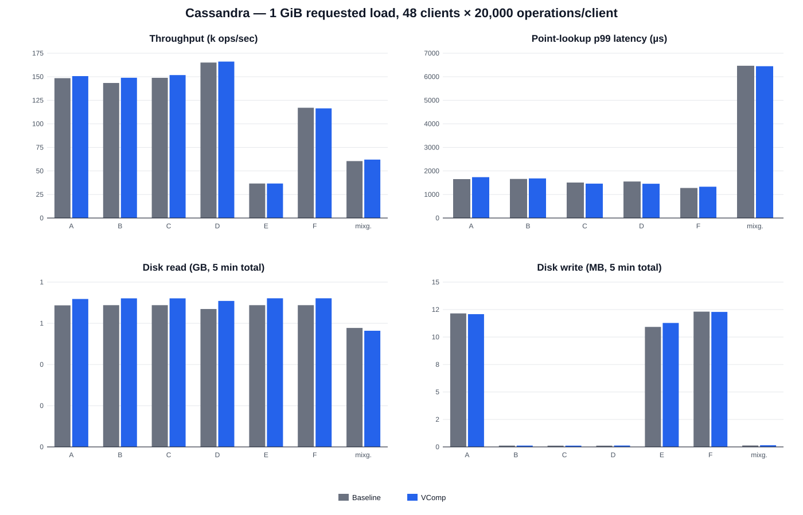

# Cassandra YCSB / MixGraph comparison

- Status: successful 1 GiB qualification pilot
- Raw source: `/work/vcomp-pebble-1tb/cassandra-vcomp-1g-fixedtrace-q1-20260913-154924`
- Layout: 100 partition keys ordered by their actual Murmur3 tokens; disjoint
  scalar clustering-key ranges follow that token order
- Compaction: native UCS T4 picker kernel on both paths, seed 20260909
- Runtime provenance: the packaged daemon JAR was rebuilt, hashed, and checked
  for the seeded-picker hook before either load
- Inputs: preserved baseline and VComp DBs; one isolated hard-linked checkpoint per workload
- Workload: 48 client threads, 20,000 operations per client; same seed and operation count for both systems
- Cache start: scoped `POSIX_FADV_DONTNEED` on each checkpoint before Cassandra startup
- Disk I/O: `/proc/diskstats` delta for `md0` over the exact client interval

## Load result

| Metric | Native baseline | VComp | VComp difference |
|---|---:|---:|---:|
| Completion time | 48.747 s | 2.530 s | -94.81% (19.27x) |
| Device writes | 2.541 GiB | 0.676 GiB | -73.41% |
| Final physical size | 0.641 GiB | 0.672 GiB | +4.84% |
| Live rows | 662,885 | 690,994 | +4.24% |
| Final SST count | 8 | 8 | 0% |

## Fixed-operation workload result

Every baseline/VComp pair below executed exactly 960,000 operations. Throughput
deltas were A +1.48%, B +3.86%, C +1.95%, D +0.61%, E -0.00%, F -0.54%, and
MixGraph +2.61%. This removes the time-based-prefix confound in the rejected
single-partition run, where a faster side also executed a larger number of
mutations.

| Workload | System | Throughput (ops/s) | Point p50 (µs) | Point p95 (µs) | Point p99 (µs) | Scan p99 (µs) | Read misses | Disk read (GB) | Disk write (MB) |
|---|---|---:|---:|---:|---:|---:|---:|---:|---:|
| A | Baseline | 148495 | 246 | 627 | 1654 | 0 | 128039 | 0.687 | 12.149 |
| A | VComp | 150695 | 234 | 650 | 1736 | 0 | 119530 | 0.718 | 12.083 |
| B | Baseline | 143419 | 244 | 565 | 1661 | 0 | 277751 | 0.688 | 0.119 |
| B | VComp | 148950 | 230 | 487 | 1681 | 0 | 253842 | 0.721 | 0.119 |
| C | Baseline | 148869 | 248 | 512 | 1506 | 0 | 365633 | 0.688 | 0.115 |
| C | VComp | 151779 | 246 | 468 | 1460 | 0 | 339702 | 0.721 | 0.115 |
| D | Baseline | 165091 | 210 | 450 | 1551 | 0 | 127077 | 0.669 | 0.115 |
| D | VComp | 166105 | 205 | 488 | 1455 | 0 | 130899 | 0.709 | 0.123 |
| E | Baseline | 36629 | 0 | 0 | 0 | 3879 | 0 | 0.688 | 10.924 |
| E | VComp | 36627 | 0 | 0 | 0 | 3756 | 0 | 0.721 | 11.280 |
| F | Baseline | 117081 | 212 | 460 | 1277 | 0 | 166241 | 0.688 | 12.313 |
| F | VComp | 116450 | 204 | 445 | 1330 | 0 | 150395 | 0.721 | 12.284 |
| MixGraph | Baseline | 60472 | 352 | 2589 | 6468 | 29475 | 257614 | 0.577 | 0.131 |
| MixGraph | VComp | 62048 | 343 | 2527 | 6447 | 30327 | 229635 | 0.564 | 0.152 |

## Interpretation limits

This is a scale qualification run, not the final paper measurement. The
baseline and VComp key populations remain different because an approximate PLR
descriptor is inverted during materialization; the different miss counts make
that limitation explicit. The result establishes that ordered bounded
partitions and equal operation prefixes remove the gross workload/layout
artifact seen with one giant partition. It does not establish exact key-set
equivalence. The retained raw DB and hard-link checkpoints are not copied into
this Git-facing bundle.
