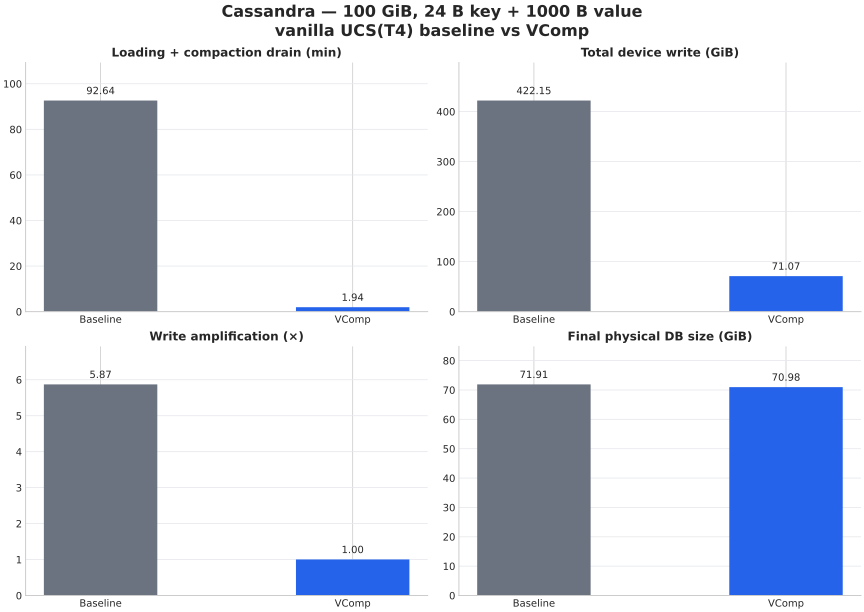
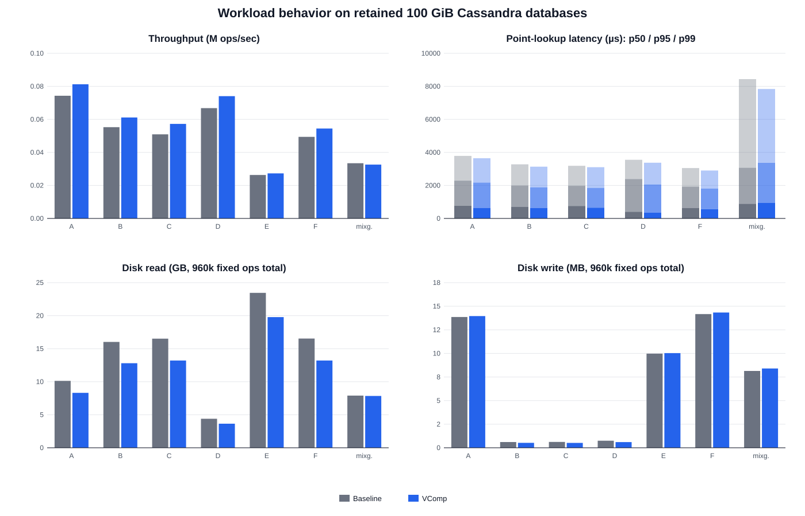

# Cassandra YCSB / MixGraph comparison

- Status: successful 100 GiB scale qualification; workload fidelity needs follow-up
- Raw source: `/work/vcomp-pebble-1tb/cassandra-vcomp-100g-fixedtrace-q1-20260913-160245`
- Layout: 10,000 partition keys ordered by actual Murmur3 token, with disjoint
  global clustering-key ranges
- Compaction: UCS T4 on both paths, picker seed 20260909; the packaged daemon
  JAR was rebuilt, hashed, and inspected before either load
- Inputs: preserved baseline and VComp DBs; one isolated hard-linked checkpoint per workload
- Workload: 48 client threads, 20,000 operations per client; same seed and operation count for both systems
- Cache start: scoped `POSIX_FADV_DONTNEED` on each checkpoint before Cassandra startup
- Disk I/O: `/proc/diskstats` delta for `md0` over the exact client interval

## Load result

| Metric | Native baseline | VComp | VComp difference |
|---|---:|---:|---:|
| Completion time | 5,558.277 s | 116.419 s | -97.91% (47.7x) |
| Device writes | 422.153 GiB | 71.066 GiB | -83.17% |
| Final physical size | 71.906 GiB | 70.979 GiB | -1.29% |
| Live rows | 66,278,498 | 66,549,593 | +0.409% |
| Final SST count | 184 | 165 | -10.33% |

## Fixed-operation summary

Each baseline/VComp pair executed exactly 960,000 operations. VComp throughput
deltas were A +9.33%, B +10.63%, C +12.40%, D +10.90%, E +3.70%, F +10.24%,
and MixGraph -2.44%. This is much closer than the rejected single-partition
workload C result (+55.13%), but the read-heavy results remain outside the
roughly ±4% spread of the 1 GiB qualification and require layout analysis.

| Workload | System | Throughput (ops/s) | Point p50 (µs) | Point p95 (µs) | Point p99 (µs) | Scan p99 (µs) | Read misses | Disk read (GB) | Disk write (MB) |
|---|---|---:|---:|---:|---:|---:|---:|---:|---:|
| A | Baseline | 74301 | 778 | 2290 | 3789 | 0 | 130972 | 10.133 | 13.861 |
| A | VComp | 81236 | 643 | 2175 | 3645 | 0 | 127613 | 8.320 | 13.955 |
| B | Baseline | 55272 | 712 | 1989 | 3279 | 0 | 280477 | 16.021 | 0.610 |
| B | VComp | 61149 | 625 | 1886 | 3135 | 0 | 277679 | 12.801 | 0.520 |
| C | Baseline | 50941 | 756 | 1975 | 3189 | 0 | 408858 | 16.523 | 0.623 |
| C | VComp | 57259 | 653 | 1849 | 3103 | 0 | 415609 | 13.211 | 0.516 |
| D | Baseline | 66791 | 405 | 2386 | 3553 | 0 | 163809 | 4.390 | 0.745 |
| D | VComp | 74070 | 350 | 2059 | 3375 | 0 | 154636 | 3.642 | 0.602 |
| E | Baseline | 26305 | 0 | 0 | 0 | 5743 | 0 | 23.451 | 9.978 |
| E | VComp | 27279 | 0 | 0 | 0 | 5317 | 0 | 19.784 | 10.031 |
| F | Baseline | 49394 | 642 | 1931 | 3054 | 0 | 250175 | 16.539 | 14.168 |
| F | VComp | 54451 | 562 | 1805 | 2904 | 0 | 247351 | 13.216 | 14.336 |
| MixGraph | Baseline | 33433 | 893 | 3068 | 8438 | 91881 | 290021 | 7.899 | 8.143 |
| MixGraph | VComp | 32616 | 938 | 3373 | 7840 | 82969 | 293732 | 7.847 | 8.401 |

## Interpretation limits

The row count and final bytes pass the scale fidelity gate, but the 184 versus
165 SST count means the workload pair is not structurally identical. The
different reconstructed key set also remains visible in point-read misses.
These results are valid diagnostics for the exact retained DBs, not yet a pure
performance comparison over identical physical and logical states. The next
iteration should analyze per-token/shard SST coverage and read I/O before any
paper-scale claim or 1 TiB launch.
